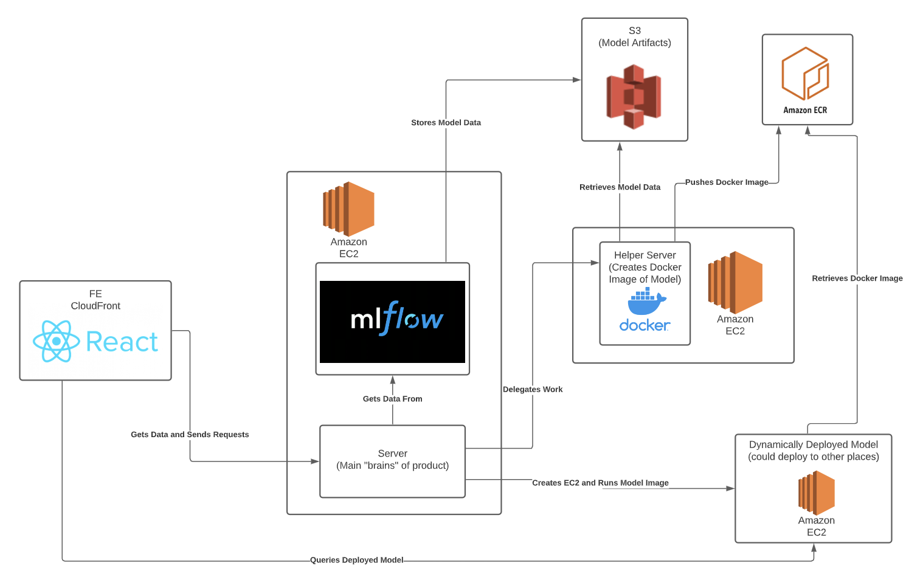

## Verisk Capstone Project Resources

This repository contains all of the resources that were created by the BYU Verisk Capstone Team in 2020 ~ 2021. 

This is a monorepository containing the following main projects:

`verisk-frontend` - A React codebase that generates a frontend that allows registerd models to be deployed

`docker-server` - A Node.js server that computes docker images and pushes them to ECR

`proxy-server` - A Node.js server that proxies request to MLFlow UI and exposes endpoints for deployment to be called by the frontend.

These codebases are the main part of our architecture:



### Steps To Recreate Environments
Setup: We will need an AWS account number to make the AMIs available
1. Create the stack on AWS CloudFormation using the provided template .yaml. A ssh key will need to be provided.
2. Clone our FE github repo ([https://github.com/JaredEzz/verisk-frontend/](https://github.com/JaredEzz/verisk-frontend/))
3. Change FE environment variables (.env in root project directory)
    1. Get “MLFlowHost” EC2 instance public IPv4 DNS Address to populate environment variables from stack resources
    2. REACT_APP_SERVER_URL= [new address]
4. Upload FE project folder to S3 bucket “FrontendBucket” in stack resources

#### EC2 that holds the MLFlow Server and Proxy Server

1. ssh into MLFlowHost EC2 instance
2. cd into verisk-server-two
3. edit .env, change MICROSERVICE_ENDPOINT to http://[new address]:8000/docker where new address is the public IPv4 DNS address of the “Dockerizer” EC2 instance in stack resources
4. also in .env, change KEY_NAME, IAM_ID, SUBNET_ID and SECURITY_GROUP_ID to account-specific values
5. export S3_URI=[uri], where uri is the s3 bucket uri where the mlflow artifacts are stored (e.g. s3://verisk-trial/models)
6. cd out into the parent directory, then run ./startup.sh, chmod to make it executable if necessary

#### Docker Compute Server

1. Ssh into Dockerizer EC2 instance
2. cd into docker-server
3. Edit .env, change MLFLOW_HOSTER_URL to http://[new address]:8000 where new address is the public IPv4 DNS address of the “MLFlowHost” EC2 instance from stack resources
4. cd out into the parent directory and run ./startup.sh, chmod to make it executable if necessary
---
### How to Launch EC2

This document describes the scripts/processes we use to launch an EC2 and run an ML Model on it.  The implementation of this process is found in the main server code (MLFLowHost), specifically [deploy.py](http://deploy.py) and deploy-ec2.js

OPTIONS THAT WE USED: (Command Line Interface Equivalents)

- Subnet VPC TODO: REPLACE WITH OWN SUBNET (or use default)
    - `--subnet-id subnet-02fae22e3e7147ba0`
- Amazon Linux 2 AMI (free-tier) AMI:
    - `--image-id ami-0915bcb5fa77e4892`
- Type
    - `--instance-type t2.micro`
- Security Group TODO: REPLACE WITH OWN SECURITY GROUP
    - `--security-group-ids sg-056ff00b48bd090df` (verisk-capstone)
- Key Pair TODO: REPLACE WITH OWN KEY PAIR
    - `--key-name verisk-team`
- Count
    - `--count 1`
- IAM Instance Profile TODO: REPLACE WITH OWN IAM ROLE
    - `--iam-instance-profile Name=verisk-ec2`
- Run on remote host option
    - `--user-data <SCRIPT>` This provides a script to be run by the ec2 instance at launch.  We use this script to pull and run a docker image from ECR that has our ML Model

SCRIPT TO CREATE EC2 AND RUN IMAGE ON IT (Command Line Interface Equivalent):

1. Run an instance:
```
aws ec2 run-instances 
  --image-id ami-042e8287309f5df03 
  --instance-type t2.micro --count 1 
  --tag-specifications 'ResourceType=instance,Tags=[{Key=deployID,Value=<id>}]' 
  --subnet-id subnet-02fae22e3e7147ba0 
  --security-group-ids sg-056ff00b48bd090df 
  --key-name verisk-team 
  --iam-instance-profile Name=verisk-ec2 
  --user-data <script from below> 
(Needed Subnet id and security group for BYU AWS, so those aren't necessary)
```

2. Retrieve the public DNS name

```aws ec2 describe-instances 
  --filters "Name=tag:deployID,Values=<id>" 
  --query "Reservations[*].Instances[*].{Instance:PublicDnsName}" 
  --output text
```

This is the script that is passed into the EC2 to be run once the EC2 is created:

3. Deploy Image on port 8080:

```bash
sudo apt-get update
sudo apt install apt-transport-https ca-certificates curl software-properties-common -y
curl -fsSL https://download.docker.com/linux/ubuntu/gpg | sudo apt-key add -
sudo add-apt-repository "deb [arch=amd64] https://download.docker.com/linux/ubuntu bionic stable"
sudo apt update
apt-cache policy docker-ce
sudo apt install docker-ce -y
curl "https://awscli.amazonaws.com/awscli-exe-linux-x86_64.zip" -o "awscliv2.zip"
sudo apt install unzip
sudo unzip awscliv2.zip
sudo ./aws/install
aws ecr get-login-password --region us-east-1 | sudo docker login --username AWS --password-stdin 383367762271.dkr.ecr.us-east-1.amazonaws.com
sudo docker run -d -p 8080:8080 383367762271.dkr.ecr.us-east-1.amazonaws.com/midterm_demo:latest
```
---

### Building + Pushing Docker Images to ECR

```bash
echo "Authenticating docker with AWS"
aws ecr get-login-password --region us-east-1 | docker login --username AWS --password-stdin $3
echo "Building docker image from given s3 uri: "
echo $1
mlflow models build-docker -m $1 -n $2
echo "Creating ECR repo for image"
aws ecr create-repository --repository-name $2 --region $4
echo "Tagging docker image:"
docker tag $2:latest $3/$2:latest
echo "Pushing docker image:"
docker push $3/$2:latest
echo "Push successful"
echo "Image exists at:"
echo $3/$2:latest

// Replace variables with:
$1 - s3 uri for registered model ( 
$2 - docker image name / ecr repo name
$3 - ecr url (may be able to get from create-repository output)
$4 - ecr region (us-east-1)
```

Sample command:
```bash
sh build_docker.sh \
  s3://verisk-trial/models/0/942a0174d2f54888a23dc9269d98d69c/artifacts/model \
  testimage0406 383367762271.dkr.ecr.us-east-1.amazonaws.com \
  us-east-1
```

---
#### Setting Up EC2 to Build MLFlow Docker Image & Curl It

OUR NOTES ON SETTING UP A SERVER TO BUILD AND DEPLOY DOCKER IMAGES FOR SAMPLE MLFLOW MODEL

NOTE: I am trying this with a t2.medium instance with 30GiB storage

- apt-get update/upgrade
- `git clone [https://github.com/mlflow/mlflow](https://github.com/mlflow/mlflow)`
- sudo apt-get install python3-pip -y
- pip3 install mlflow (other dependencies in [extras] may be necessary)
    - NOTE: install Cython first (`pip3 install Cython`)
- pip3 install sklearn
- python3 sklearn_logistic_regression/train.py (returns model run hash)
- `wget [https://repo.anaconda.com/archive/Anaconda3-2020.07-Linux-x86_64.sh](https://repo.anaconda.com/archive/Anaconda3-2020.07-Linux-x86_64.sh)`
    - NOTE: In Home directory? YES
- `bash [Anaconda3-2020.07-Linux-x86_64.sh](https://repo.anaconda.com/archive/Anaconda3-2020.07-Linux-x86_64.sh)` do not init conda env
- `export MLFLOW_CONDA_HOME=/home/ubuntu/anaconda3`
- cd into model directory, something like `mlflow/examples/mlruns/0/a9c00bbede71408f8c9f8ca29567537d/artifacts/model`
- change anaconda channel in conda.yaml from `conda-forge` to `anaconda`
- `mlflow models serve -m .` from within the model/ dir
    - NOTE: I had to run `source /home/ubuntu/.profile` to get mlflow to register in the PATH
- tmux before ^^, split panes with `Ctrl-B, %` , then in the left pane do the serve, and in the right pane (`Ctrl-B, →`) do the curl
- `curl -d '{"columns":["x"], "data":[[1], [-1]]}' -H 'Content-Type: application/json; format=pandas-split' -X POST localhost:5000/invocations`
- response should be `[1, 0]`

install docker

- `sudo apt install apt-transport-https ca-certificates curl software-properties-common`
- `curl -fsSL [https://download.docker.com/linux/ubuntu/gpg](https://download.docker.com/linux/ubuntu/gpg) | sudo apt-key add -
sudo add-apt-repository "deb [arch=amd64] [https://download.docker.com/linux/ubuntu](https://download.docker.com/linux/ubuntu) bionic stable"`
- `sudo apt update`
- `apt-cache policy docker-ce`
- `sudo apt install docker-ce`
- `docker run hello-world` (just to check)

allow access to docker if not enabled

- [https://www.digitalocean.com/community/questions/how-to-fix-docker-got-permission-denied-while-trying-to-connect-to-the-docker-daemon-socket](https://www.digitalocean.com/community/questions/how-to-fix-docker-got-permission-denied-while-trying-to-connect-to-the-docker-daemon-socket)
- `sudo groupadd docker`
- `sudo usermod -aG docker ${USER}`
- sign out (of ec2/ssh) and back in

create docker image from mlflow run

- mlflow models build-docker -m "mlruns/0/1ffe7d1d3dd14ca6ab4d91ee9435461d/artifacts/model/" -n "test-1206"
    - NOTE: From /examples as working directory

tmux again

- docker run "test-1206"
    - I found out the default port when running mlflow models build-docker is to run the model on port 8080 of the container.  I was trying to map port 5000, but read the docs and found that it defaults it to 8080.
    - `docker run -p 8080:8080 "test-1206"` ⭐️⭐️⭐️⭐️⭐️⭐️⭐️⭐️
    - `curl -d '{"columns":["x"], "data":[[1], [-1]]}' -H 'Content-Type: application/json; format=pandas-split' -X POST 127.0.0.1:8080/invocations` in other window for same result as previous curl
    - This can also be curled from any other machine by switching the "127.0.0.1" with the address of the ec2

Pushing to ecr

Install aws cli 2

- curl "[https://awscli.amazonaws.com/awscli-exe-linux-x86_64.zip](https://awscli.amazonaws.com/awscli-exe-linux-x86_64.zip)" -o "awscliv2.zip"
unzip awscliv2.zip
sudo ./aws/install
- aws ecr get-login-password --region us-east-1 | docker login --username AWS --password-stdin [383367762271.dkr.ecr.us-east-1.amazonaws.com](http://383367762271.dkr.ecr.us-east-1.amazonaws.com/)
- `docker tag [image name] [383367762271.dkr.ecr.us-east-1.amazonaws.com/lambdarepo:latest](http://383367762271.dkr.ecr.us-east-1.amazonaws.com/lambdarepo:latest)`†

- I can get to this point without conda, then serve and docker image doesn't work
- echo `python3 -m site --user-base`/bin to find where mlflow is, then add that to path (if not already)
- added `export PATH="/home/jaredezzethasson/.local/bin:$PATH"` to .bashrc
- add `export PATH="/home/jaredezzethasson/anaconda3/bin:$PATH"` to .bashrc
- mlflow run sklearn_elasticnet_wine -P alpha=0.42

add anaconda channel to /mlruns/0/[hash]/artifacts/model/conda.yaml [https://github.com/mlflow/mlflow/issues/2148](https://github.com/mlflow/mlflow/issues/2148)

conda update -n base -c defaults conda

started these to try to do mlflow serve ^^ but didn't work, moving onto just creating a docker image

TODO:

export environment variables in profile, consult Harrison to know which file to use

- `MLFLOW_CONDA_HOME=/home/ubuntu/anaconda3`
- `MLFLOW_TRACKING_URI=http://ec2-3-223-6-95.compute-1.amazonaws.com:5000`

--- 

### Adding a Separate SQL Instance to MLFlow
This document shows you how to get the `Register a Model` feature working on a running MLFlow UI instance.

1. Previously, we weren't sure whether having a SQL datastore was going to fix our error, but [this nice stack overflow answer](https://stackoverflow.com/questions/63255631/mlflow-invalid-parameter-value-unsupported-uri-mlruns-for-model-registry-s) confirms that this is indeed the case:

    ```
    Mlflow required DB as datastore for Model Registry So you have to run tracking server with DB as backend-store and log model to this tracking server. The easiest way to use DB is to use SQLite.

    mlflow server \
        --backend-store-uri sqlite:///mlflow.db \
        --default-artifact-root ./artifacts \
        --host 0.0.0.0
    ```

2. I vaguely remember having a sqlite file that's just locally stored from CS 240 projects, but I didn't remember enough so this website runs you through how to create a `.db` file. 

    Run `sqlite3 mlflow.db` which starts the SQLite CLI environment. In this env, you can directly execute SQLite queries and run other commands to mutate your db contents. Pretty crazy that this `.db` file essentially represents and entire database. You'll have to run at least one SQLite query that creates something to create a file so I just ran in the environment:
    `create table tbl1(one varchar(10), two smallint);`

    Leave the env by typing `.quit()`

3. Now it's time to reference this file in our MLFlow UI start-up command. Again, make sure you run all mlflow commands after going to this directory, as mentioned in Jacob's document.

    ```bash
    cd /home/ubuntu/miniconda3/envs/mlflow-1abc00771765dd9dd15731cbda4938c765fbb90b/lib/python3.7/site-packages/mlflow
    ```

    Then run our new and improved™  command that hooks up our SQL backend.

    ```bash
    mlflow server \
        --backend-store-uri sqlite:////home/ubuntu/mlflow.db \
        --default-artifact-root s3://verisk-trial/models \
        --host 0.0.0.0
    ```

    I ran into some strange SQL issues that were eventually resolved by adding 4 slashes in front of the absolute path...[reference here](https://stackoverflow.com/questions/7670289/sqlite3-operationalerror-unable-to-open-database-file). The db file is currently saved at the base directory of our project, along with all of our other files.

To confirm that everything is working, I followed the "How To Run An Experiment And Have It Show Up On MLFlow UI" document I made. As you can tell, naming and registering an experiment doesn't give us any errors ❤️


As a result, we can now see the "Models" tab on the website! [http://ec2-3-223-6-95.compute-1.amazonaws.com:5000/#/models](http://ec2-3-223-6-95.compute-1.amazonaws.com:5000/#/models).


Again, the whole reason why we needed to set this up is so that we can make requests against MLFlow's REST API to get a list of all registered models so that the frontend can display it.

Lo and behold:


 

